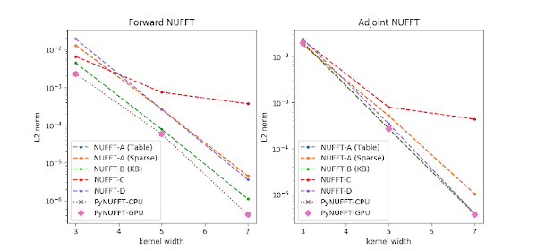
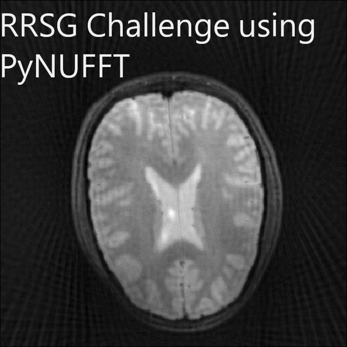

# PyNUFFT: Python non-uniform fast Fourier transform

A minimal "getting start" tutorial is available at http://jyhmiinlin.github.io/pynufft/ .


## Installation

$ pip install pynufft --user


### Using Numpy/Scipy

```
$ python
Python 3.6.11 (default, Aug 23 2020, 18:05:39) 
[GCC 7.5.0] on linux
Type "help", "copyright", "credits" or "license" for more information.
>>> from pynufft import NUFFT
>>> import numpy
>>> A = NUFFT()
>>> om = numpy.random.randn(10,2)
>>> Nd = (64,64)
>>> Kd = (128,128)
>>> Jd = (6,6)
>>> A.plan(om, Nd, Kd, Jd)
0
>>> x=numpy.random.randn(*Nd)
>>> y = A.forward(x)
```

### Using PyCUDA

```
>>> from pynufft import NUFFT, helper
>>> import numpy
>>> A2= NUFFT(helper.device_list()[0])
>>> A2.device
<reikna.cluda.cuda.Device object at 0x7f9ad99923b0>
>>> om = numpy.random.randn(10,2)
>>> Nd = (64,64)
>>> Kd = (128,128)
>>> Jd = (6,6)
>>> A2.plan(om, Nd, Kd, Jd)
0
>>> x=numpy.random.randn(*Nd)
>>> y = A2.forward(x)
```

### Using NUDFT_cupy and NUDFT (double precision, experimental)

Some users ask for double precision. 
NUDFT and NUDFT_cupy are offered.
Speedup is dependent on cupy and GPU.  


```
>>> from pynufft import NUDFT_cupy, NUDFT
>>> import numpy
>>> A2= NUDFT_cupy()
>>> om = numpy.random.randn(10,2)
>>> Nd = (64,64)
>>> A2.plan(om, Nd)
>>> x=numpy.random.randn(*Nd)
>>> y = A2.forward(x)
>>> A = NUDFT()
>>> A.plan(om, Nd)
>>> y_cpu = A.forward(x)
>>> print(numpy.linalg.norm(y.get() - y_cpu))
6.752054788357788e-14
```


## Testing GPU acceleration

```
Python 3.6.11 (default, Aug 23 2020, 18:05:39) 
[GCC 7.5.0] on linux
Type "help", "copyright", "credits" or "license" for more information.
>>> from pynufft import tests
>>> tests.test_init(0)
device name =  <reikna.cluda.cuda.Device object at 0x7f41d4098688>
0.06576069355010987
0.006289639472961426
error gx2= 2.0638987e-07
error gy= 1.0912560261408778e-07
acceleration= 10.455399523742015
17.97926664352417 2.710083246231079
acceleration in solver= 6.634211944790991
```
### Comparisons



### On the misleading information in the IEEE-ISBI 2019 tutorial

I am sorry but here is the snapshot forked from the tutorial at that time of presentation.
https://github.com/jyhmiinlin/isbi19-tutorial
First of all, this may not be scientific misconduct but I am very disappointed that their methods didn't quite follow the tutorial of PyNUFFT.
In fact, their jupyter notebook is full of errors. 
Please note that users had agreed on the "Disclaimer of Warranty" when they are using PyNUFFT. 
To be clear, the purpose of the PyNUFFT package is to provide a fast and accurate NUFFT implementation on OpenCL/CUDA devices, apart from Numpy/Scipy. 
There has been a consensus that users of the PyNUFFT package should develop their solver, instead of delivering wrong information and abuse this package. 
Users should take full responsibility for using any solver in their tests. They should take care of the programming details, DFT, and their applications.
Actually, his own "superior" work is built on top of the GPU part of PyNUFFT (not the "GPU version of NFFT" as claimed). 
However, this tutorial was deliberately shedding a negative light on PyNUFFT.
They are abusing our free service and giving negative comments. This is a kind of "Corporate Abuse of Open Source" https://dev.to/lethargilistic/open-source-has-not-failed-dont-cover-up-corporate-abuse-of-open-source-3ffe .
One of our colleagues has corrected the error but there are more errors. We don't and we can't waste our time and teach them basic MRI reconstructions.
We kindly ask the author to truly learn science (not to abuse PyNUFFT in the wrong way and present the misleading benchmark at the same time). 
I suggest them not to use PyNUFFT.

### On the Off-the-grid data-driven optimization of sampling schemes...

https://arxiv.org/pdf/2010.01817

" ...... and Python toolboxes begin to emerge [cite PyNUFFT]. Our experience using them however led to unstable results due to significant numerical errors."

If they want double-precision, they may want to try pynufft.NUDFT and pynufft.NUDFT_cupy. 

### On the RRSG challenge of reproducible research in ISMRM 2019

Some reports deliberately demonstrated bad results from PyNUFFT. Again, they are takig full responsibility for their activities. 

Actually, PyNUFFT is doing great for the challenge. Our result is as follows. (The code is available on request)



### Contact information
J.-M. Lin
email: pynufft@gamil.com

